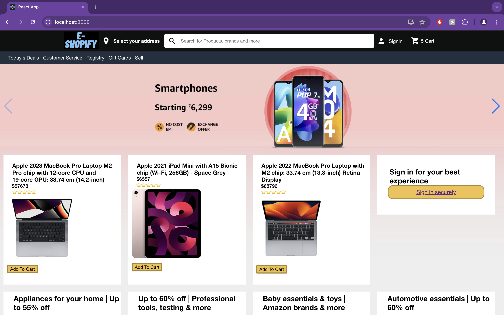

# E-Shopify

## 📌 Introduction

[](https://awesome.re)

This repository is about a responsive e-commerce MERN stack web app that allows users to shop for a wide range of products, from daily essentials to electronics. It includes features like pagination, login, registration, secure authentication, and a user-friendly interface.

## 🚀 View Live Demo


<pre><center><a href="https://my-kdi7bxw5e-subhash-prasads-projects.vercel.app"><b>https://my-kdi7bxw5e-subhash-prasads-projects.vercel.app</b></a></center></pre>

## 👨‍💻 Tech Stack Used

### Frontend
 - ReactJS, TailwindCSS, Material UI, JavaScript, React-icons
### Backend
 - Node.js, Express.js, JWT, MongoDB, Firebase

## 🛠️ Installation Steps

Star and Fork the Repo 🌟 and this will keep us motivated.

1. Clone the repository

```bash
git clone https://github.com/subhashdippu/E-Shopify.git
```

2. Change the working directory

```bash
cd E-Shopify
```

3. Install dependencies

```bash
npm install
```

4. Run the app

```bash
npm run start
```

## 📸 Screenshots




